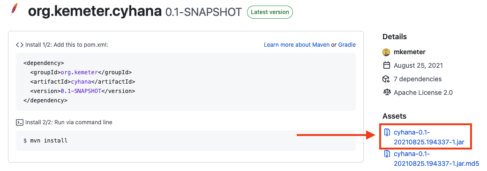
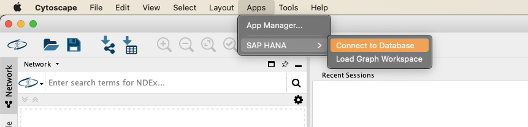
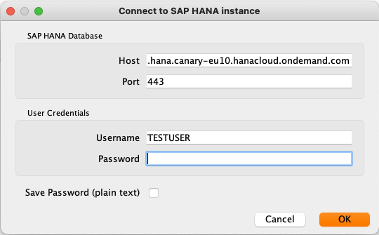
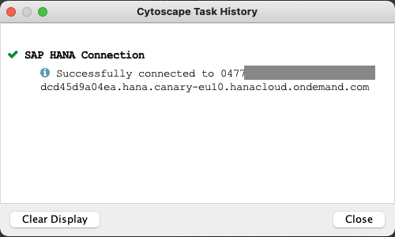
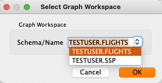
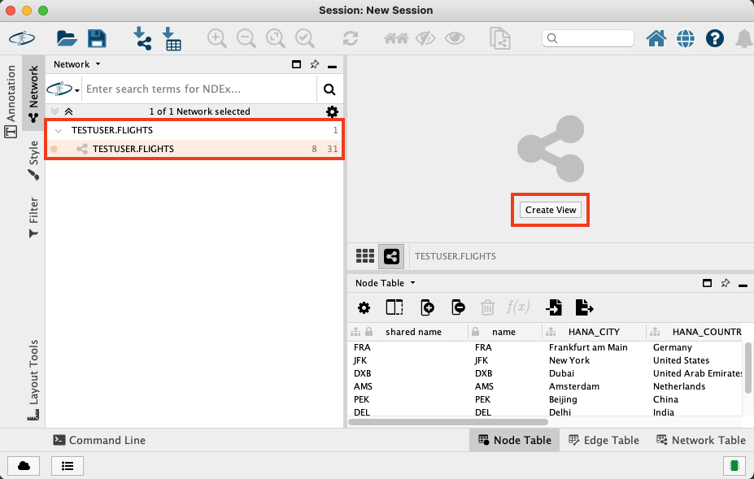
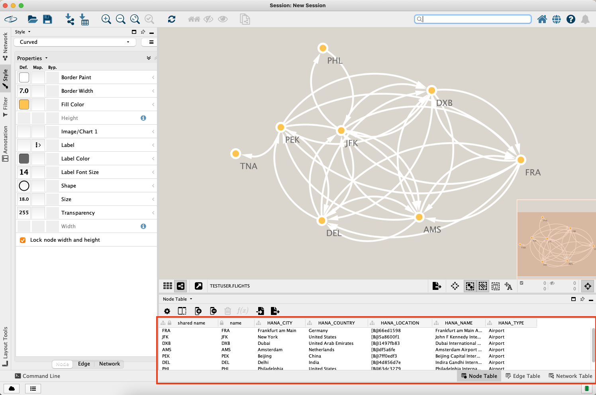

# Cytoscape Plugin for SAP HANA
The Cytoscape Plugin for SAP HANA (cyHANA) is an app to connect Cytoscape to SAP HANA Graph. The current preliminary version has a rather reduced feature scope. If time allows, the scope and matureness of the plugin may improve in future.

> Please note, that although I am associated with SAP this is **not** an official plugin by SAP, but rather a spare time project.

The plugin is tested to work with [Cytoscape 3.8.2](https://cytoscape.org/), [SapMachine 11](https://sap.github.io/SapMachine/) and [NGDBC 2.9.16](https://tools.hana.ondemand.com/#hanatools).

## Functionalities
The current feature scope comprises:
- Establish connection to SAP HANA (Cloud)
- Load all nodes and edges of an existing (homogeneous) graph workspace

## Installation
### Download
The latest (bleeding edge) package can be downloaded in the [packages section](https://github.com/mkemeter/cyHANA/packages). Check the `Assets` list for the latest jar file.

### Setup
After getting the latest JAR package, you can install the plugin using the [Cytoscape App Manager](http://manual.cytoscape.org/en/stable/App_Manager.html). 

The plugin makes use of the SAP HANA JDBC client, which additionally needs to be included on the classpath. The latest version can be retrieved from the [SAP Development Tools](https://tools.hana.ondemand.com/#hanatools) (look for [ngdcb-latest.jar](https://tools.hana.ondemand.com/additional/ngdbc-latest.jar)).

On my Mac, it did the job to copy `ngdbc-latest.jar` to `/Applications/Cytoscape_v3.8.2/framework/lib/openjfx/mac`. However, there may be more suitable ways to include the driver. As a Java amateur, I'd be happy to get to know them (Seriously! Please reach out!).

After installation, you should be able to find the plugin under `Apps` > `SAP HANA`.

## Usage
### Establishing a Connection to SAP HANA (Cloud)
To establish a connection to SAP HANA (Cloud), you will need to enter host, port, username and your password. The credentials will be cached locally in the user folder to make future connections more convenient.

For even more convenience and at the cost of security, you can optionally store the password. 

> Please be aware, that your password will be stored as plain text!

You can check the task history of Cytoscape to verify, that the connection has been established successfully.

### Load an existing Graph Workspace
To load a graph workspace, you first need to connect to your instance of SAP HANA as described above. When choosing to load graph workspace, the list will already be pre-populated with all graph workspaces, that have been found on the respective system.

After choosing the respective workspace and confirming with `OK`, the nodes and edges table will be loaded into Cytoscape. Note, that it will not yet create a visualization, but only show the network on the left panel.

By choosing `Create View`, you can create an initial visualization and adapt it using Cytoscape's tools.

Note, that in the `Node Table` and `Edge Table` you can also inspect the attribute data from the respective tables in SAP HANA.